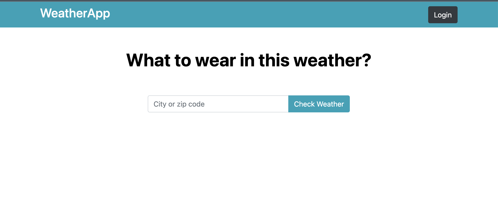

# AI WeatherApp

AI WeatherApp is a web application that provides real-time weather information for any location and generates clothing recommendations based on the weather conditions using the OpenAI GPT-3 API.

## Features

- **Weather Information**: Get the current temperature, humidity, wind speed, and weather description for your chosen location.

- **Clothing Recommendations**: Receive personalized clothing recommendations based on the weather conditions, ensuring you're dressed appropriately for the day.

## Screenshots

### Home Page



### Weather Details and Clothing Recommendations

!


## Installation

Depending on your environment, you'll need to install the appropriate set of dependencies. We have separate requirement files for different environments:

- `requirements/base.txt`: Common requirements for all environments.
- `requirements/dev.txt`: Additional requirements for development.
- `requirements/prod.txt`: Additional requirements for production.

Choose the appropriate requirement file based on your environment and follow the steps below.

## Setting Up the Development Environment

### Create a Virtual Environment

``` python
python -m venv venv
source venv/bin/activate
```

### Install Development Dependencies
``` python
pip install -r requirements/base.txt -r requirements/dev.txt
``` 

### Database Setup and Migrations
``` python
python manage.py migrate
``` 

### Start the Development Server

``` python
python manage.py runserver
``` 

Visit http://localhost:8000 in your web browser to access the Weather App.


## Production Environment
For a production-ready deployment, follow these steps:

1. Clone the repository on your production server.

2. Create a virtual environment and activate it.

3. Install the production dependencies:

```python
pip install -r requirements/base.txt -r requirements/prod.txt
```

4. Configure your production database settings.

5. Set up a production-ready web server .

6. Deploy your app to the production server and set up any necessary server configurations.

7. Start the production server and configure it to run your app.

Your Django Weather App should now be accessible in a production environment.

## Usage
Open the Weather App in your web browser.

1. Enter the name of the location or ZIP code you want to check the weather for in the search bar.

2. Click the "Get Weather" button.

3. The app will display the current weather conditions and clothing recommendations.


## Technologies Used
- Django
- Python
- HTML/CSS
- OpenWeatherMap API
- OpenAI GPT-3 API

## Contributing
Contributions to the Django Weather App are welcome! Feel free to open issues, submit pull requests, or provide feedback.

## License
This project is licensed under the MIT License - see the [LICENSE](LICENSE.txt) file for details.
